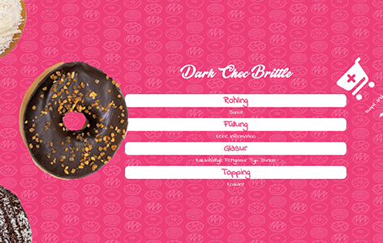

# 🍩 Donut Duck – Swipe & Pick Shop-UI

Ein interaktiver Donut-Shop-Prototyp mit intuitivem Produkt-Karussell.

## 🎮 Features

- ✅ Swipe & Scroll-Rad zur Produktauswahl
- 🍩 Donuts mit dynamischer Anzeige von Zutaten und Preis
- 🛒 Integrierter Warenkorb mit Live-Berechnung
- 🎨 Stylishes Frontend-Design & Touch-Optimierung

## 💡 Idee

Der Fokus liegt auf einem spielerischen Einkaufserlebnis, bei dem Produkte per Swipe rotiert und ausgewählt werden können – ideal für moderne Snack-Konzepte mit UX-Fokus.

## 📁 Projektstruktur

- `index.html` – Landing Page mit Zufalls-Donut
- `donuts.html` – Shop-Ansicht mit Swipe-Rad
- `donuts.js` – Produktdaten
- `script.js` – Hauptlogik fürs Rad & Warenkorb
- `fonts.css`, `index.css`, `style.css` – Design & Layout

## 🔧 Technologien

`HTML`, `CSS`, `Vanilla JavaScript`, `Responsive Design`, `Touch Events`, `Animationen`

## 🚀 Vorschau

---

> Prototype erstellt 2025 als Übung für kreative UI-Konzepte im E-Commerce.
